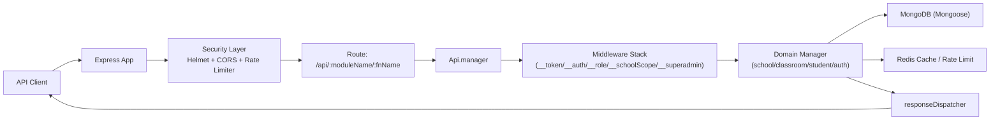
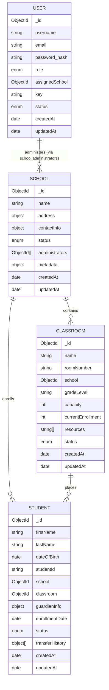

# School Management System API - Architectural Design

## 1. System Overview

This API is a role-aware school management platform built on:
- Node.js + Express (single dynamic route dispatcher)
- Mongoose + MongoDB (primary data store)
- Redis (caching and rate-limiting store)

Core business domains:
- Authentication and authorization
- School lifecycle (active, recycle-bin, permanent delete, restore)
- Classroom lifecycle (active, recycle-bin, permanent delete, restore)
- Student lifecycle (active, withdrawn, restore, transfer)

Core roles:
- `superadmin`: full cross-school control
- `school_admin`: school-scoped operations for assigned schools

---

## 2. High-Level Runtime Architecture

Design notes:
- A single dynamic API entrypoint dispatches to module methods based on URL.
- Method parameters prefixed with `__` are auto-resolved middleware dependencies.
- Domain managers encapsulate business logic and RBAC constraints.

---

## 3. API Design

### 3.1 Routing Pattern

Primary route pattern:
- `/api/:moduleName/:fnName`

Examples:
- `/api/school/listSchools`
- `/api/classroom/createClassroom`
- `/api/student/transferStudent`

### 3.2 HTTP Method Conventions

The API supports standard RESTful methods for mutating endpoints:
- `PUT` for updates/restores/transfers/assignment
- `DELETE` for delete/withdraw/permanent delete

Backward compatibility is preserved by keeping legacy `POST` mappings in `httpExposed` for existing clients.

### 3.3 Current Domain Endpoint Semantics

#### School domain
- `POST /school/createSchool` create new school (superadmin)
- `GET /school/listSchools` active schools only
- `GET /school/listDeletedSchools` recycle-bin schools
- `GET /school/getSchool` active school detail
- `PUT|POST /school/updateSchool` update school
- `DELETE|POST /school/deleteSchool` soft delete (active -> inactive)
- `PUT|POST /school/restoreSchool` restore (inactive -> active)
- `DELETE|POST /school/permanentlyDeleteSchool` hard delete from recycle bin
- `PUT|POST /school/assignAdministrator` assign admin to school

#### Classroom domain
- `POST /classroom/createClassroom` create classroom
- `GET /classroom/listClassrooms` active classrooms only
- `GET /classroom/listDeletedClassrooms` recycle-bin classrooms
- `GET /classroom/getClassroom` active classroom detail
- `PUT|POST /classroom/updateClassroom` update classroom
- `DELETE|POST /classroom/deleteClassroom` soft delete
- `PUT|POST /classroom/restoreClassroom` restore classroom
- `DELETE|POST /classroom/permanentlyDeleteClassroom` hard delete from recycle bin

#### Student domain
- `POST /student/enrollStudent` create student
- `GET /student/listStudents` excludes withdrawn students
- `GET /student/listWithdrawnStudents` withdrawn-only listing
- `GET /student/getStudent` active student detail
- `GET /student/getWithdrawnStudent` withdrawn student detail
- `PUT|POST /student/updateStudent` update student profile
- `DELETE|POST /student/withdrawnStudent` withdraw student (soft delete semantics)
- `PUT|POST /student/restoreStudent` restore withdrawn student
- `PUT|POST /student/transferStudent` transfer between schools/classrooms

### 3.4 Identifier Handling

Student endpoints support both:
- MongoDB ObjectId (`_id`)
- business student identifier (`studentId`, e.g. `SE-2024-104`)

Filter construction avoids invalid ObjectId casting by branching on `ObjectId.isValid(...)`.

---

## 4. Authorization and Scope Model

### 4.1 Security Middleware Stack

Key middleware components:
- `__token` / `__auth`: token validation
- `__role`: resolves role and assignment context
- `__schoolScope`: resolves permitted school scope per request
- `__superadmin`: strict superadmin gate for sensitive operations

### 4.2 Scope Rules

- `superadmin`
  - Full access to all schools and child resources.
- `school_admin`
  - Access limited to assigned schools.
  - Assignment is validated using school membership (`school.administrators`) and scoped middleware.

### 4.3 Lifecycle Controls

Soft-delete/recycle bin pattern:
- School/classroom delete operations mark status inactive.
- Student withdraw marks status `withdrawn`.

Restore operations:
- Require resource to be in inactive/withdrawn state.
- Preserve child links and business continuity.

Permanent delete operations:
- Allowed only from recycle-bin state.
- Includes integrity checks against linked records.

---

## 5. Database Design

## 5.1 Entity Relationship Diagram

## 5.2 Collection Design Summary

### `users`
- Purpose: authentication principal + RBAC role.
- Key constraints:
  - unique: `email`, `username`, `key`
  - role enum: `superadmin | school_admin`
  - `assignedSchool` required for `school_admin` (legacy single-assignment field)

### `schools`
- Purpose: top-level organizational boundary.
- Key fields:
  - `status`: `active | inactive`
  - `administrators`: array of `User._id` (authoritative multi-school assignment)

### `classrooms`
- Purpose: school-scoped instructional units.
- Key constraints:
  - unique compound index: `{ school, roomNumber }`
  - capacity and enrollment constraints
  - lifecycle by `status`: `active | inactive`

### `students`
- Purpose: student profile and enrollment tracking.
- Key constraints:
  - unique `studentId` (business identifier)
  - references `school` and `classroom`
  - lifecycle `status` includes `withdrawn`
  - `transferHistory` records school/classroom transitions

## 5.3 Index Strategy

Implemented indexes optimize:
- role and status filtering
- school-scoped queries
- unique business identifiers (`studentId`, user identity fields)
- sorting and lookup on common filters (`createdAt`, `status`, `school`)

---

## 6. Data Integrity and Transaction Boundaries

Transactions are used for multi-document operations where consistency matters:
- Student enrollment (create student + classroom enrollment increment)
- Student withdrawal (status change + classroom enrollment decrement)
- Student restore (status change + classroom enrollment increment)
- Student transfer (source decrement + target increment + student reassignment)

This prevents partial updates in failure scenarios.

---

## 7. API Design Recommendations (Forward)

1. Versioned public API paths
- Consider `/api/v1/...` externally, while retaining internal dynamic dispatcher.

2. Deprecation plan for legacy POST aliases
- Keep aliases during migration window.
- Add deprecation headers and sunset timeline.

3. Normalize assignment source of truth
- Prefer `school.administrators` for multi-school assignment.
- Gradually phase out reliance on single `user.assignedSchool` where feasible.

4. Contract tests for RBAC and lifecycle endpoints
- Add role-scope matrix tests for delete/restore/transfer/assignment.

---

## 8. Operational Notes

- Security layer includes Helmet and Redis-backed rate limiting.
- CORS and rate limit settings are environment configurable.
- Restore and recycle-bin endpoints require careful role governance and should be audited.

